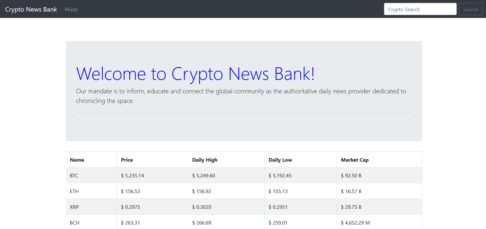
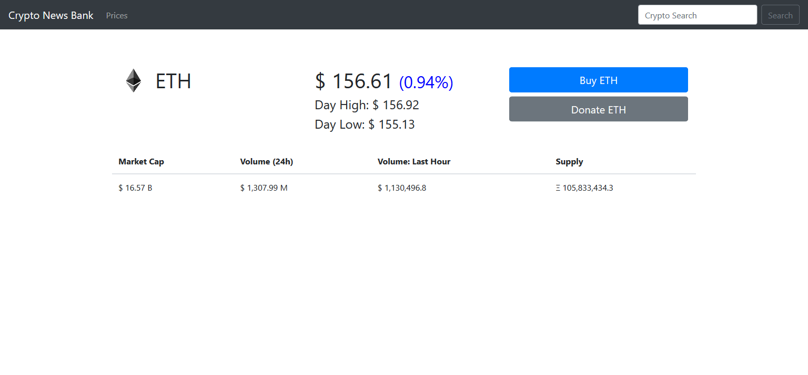

# CryptoWebApp
This website's intened purpose is for crypto lovers to be able to search crypto currency information as well as the latests news articles relevant to anything crypto.

## Header / Grid 
The header displayed a welcoming message letting the user know what this website is all about. 

Below the Jumbotron, we had a table that displays the 10 crypto crurencies and some statistics like: Daily High, Daily Low, and Market Cap.



## Crypto Media
Users can brows through the various articles revolving crypto news that are dynamically updated every time new articles are available.


## The Coin Price Section
This section displays the queried coin to the user. This section is still under construction but my plans are to add more data about the coin, news pertaining to the searched coin, and posibly a analysis graph/chart. 



## How to use API
The following information shows how I used the REST API to poulate our website with information. This process was similar thoughout the entire web application. 

(This code is a snippet from the views.py file located in this repo.) The way I implemented this was by first getting an API key from www.cryptocompare.com that allowed me to fetch the data. I had to then store our json information to a varibale. I then sent the data that was fetched from the API(from json) to the home.html.
```
	# FETCH CRYPTO NEWS
	news_request = requests.get("https://min-api.cryptocompare.com/data/v2/news/?lang=EN" +"&api_key=" +API_KEY)
	news = json.loads(news_request.content) # read our json
	return render(request,'home.html', {'news' : news, 'price':price })
 ```
(This is a code snippet from the home.html file) In order to display the data, I first had to set up a html container so the display would be formatted. The python code was just a for loop that iterated through the information being fetched by the Cyrpto Compare API from the views.py file I created. The data was set to the views by calling each json tag with the help of the for loop.

```
<div class="container">
	<div class="row">
		
			<div class="col-sm">
				<div class="card" style="width: 18rem;">
				  
				  <div class="card-body">
				    <h5 class="card-title">{{ x.title }}</h5>
				    <p class="card-text">{{ x.body }}.</p>
				    <a href="{{ x.url }}" class="btn btn-secondary">Read More...</a>
				  </div>
				</div>
				<br/>
			</div>
		
	</div>
</div>
```


## Built With

* [DJango](https://www.djangoproject.com/) - The web framework used
* [Python](https://www.python.org/) - controler
* [Crypto Compare API](https://min-api.cryptocompare.com/) - REST API used for dynamically updating web stats
* [Bootstrap](https://getbootstrap.com) - Used to generate clean HTML UI
